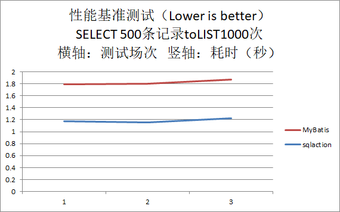

sqlaction - Database persistence layer tool based auto-gen JDBC code
===================================

<!-- TOC -->

- [1. overview](#1-overview)
- [2. A demo](#2-a-demo)
	- [2.1. Create Table DDL](#21-create-table-ddl)
	- [2.2. Create Java Project](#22-create-java-project)
	- [2.3. Executing sqlaction](#23-executing-sqlaction)
	- [2.4. Beginning to write your first line application code](#24-beginning-to-write-your-first-line-application-code)
	- [2.5. Executing your application](#25-executing-your-application)
- [3. Benchmark](#3-benchmark)
	- [3.1. Prepare `sqlaction`](#31-prepare-sqlaction)
	- [3.2. Prepare `MyBatis`](#32-prepare-mybatis)
	- [3.3. Case](#33-case)
	- [3.4. Result](#34-result)
- [4. TODO](#4-todo)
- [5. About The Project](#5-about-the-project)
- [6. About Author](#6-about-author)

<!-- /TOC -->

# 1. overview

sqlaction is a Database persistence layer tool based auto-gen JDBC code.

# 2. A demo

## 2.1. Create Table DDL

`ddl.sql`

```
CREATE TABLE `sqlaction_demo` (
  `id` int(11) NOT NULL AUTO_INCREMENT COMMENT '缂',
  `name` varchar(32) COLLATE utf8mb4_bin NOT NULL COMMENT '瀛',
  `address` varchar(128) COLLATE utf8mb4_bin DEFAULT NULL COMMENT '板',
  PRIMARY KEY (`id`),
  KEY `sqlaction_demo` (`name`)
) ENGINE=InnoDB AUTO_INCREMENT=6 DEFAULT CHARSET=utf8mb4 COLLATE=utf8mb4_bin
```

## 2.2. Create Java Project

Add jar "mysql-connector-java-X.Y.Z.jar".

Create `dbserver.conf.json` in Java package folder.

```
{
	"driver" : "com.mysql.jdbc.Driver" ,
	"url" : "jdbc:mysql://127.0.0.1:3306/calvindb?serverTimezone=GMT" ,
	"user" : "calvin" ,
	"pwd" : "calvin"
}
```

Create `sqlaction.conf.json` in Java package folder.

```
{
	"database" : "calvindb" ,
	"tables" : [
		{
			"table" : "sqlaction_demo" ,
			"sqlactions" : [
				"SELECT * FROM sqlaction_demo" ,
				"SELECT * FROM sqlaction_demo WHERE name=?" ,
				"INSERT INTO sqlaction_demo" ,
				"UPDATE sqlaction_demo SET address=? WHERE name=? @@METHOD(updateAddressByName)" ,
				"DELETE FROM sqlaction_demo WHERE name=?"
			]
		}
	] ,
	"javaPackage" : "xyz.calvinwilliams.sqlaction.demo"
}
```

## 2.3. Executing sqlaction

pp.bat

```
java -Dfile.encoding=UTF-8 -classpath "D:\Work\sqlaction\sqlaction.jar;D:\Work\mysql-connector-java-8.0.15\mysql-connector-java-8.0.15.jar" xyz.calvinwilliams.sqlaction.gencode.SqlActionGencode
pause
```

Executing pp.bat

```
//////////////////////////////////////////////////////////////////////////////
/// sqlaction v0.0.8.0
/// Copyright by calvin<calvinwilliams@163.com,calvinwilliams@gmail.com>
//////////////////////////////////////////////////////////////////////////////
--- dbserverConf ---
  dbms[mysql]
driver[com.mysql.jdbc.Driver]
   url[jdbc:mysql://127.0.0.1:3306/calvindb?serverTimezone=GMT]
  user[calvin]
   pwd[calvin]
--- sqlactionConf ---
 database[calvindb]
        table[sqlaction_demo]
                sqlaction[SELECT * FROM sqlaction_demo]
                sqlaction[SELECT * FROM sqlaction_demo WHERE name=?]
                sqlaction[INSERT INTO sqlaction_demo]
                sqlaction[UPDATE sqlaction_demo SET address=? WHERE name=? @@METHOD(updateAddressByName)]
                sqlaction[DELETE FROM sqlaction_demo WHERE name=?]
SqlActionTable.getTableInDatabase[sqlaction_demo] ...
...
...
...
*** NOTICE : Write SqlactionDemoSAO.java completed!!!
```

Auto-gen code to `SqlactionDemoSAO.java`

```
// This file generated by sqlaction v0.0.8.0

package xyz.calvinwilliams.sqlaction.demo;

import java.math.*;
import java.util.*;
import java.sql.Time;
import java.sql.Timestamp;
import java.sql.Connection;
import java.sql.Statement;
import java.sql.PreparedStatement;
import java.sql.ResultSet;

public class SqlactionDemoSAO {

	int				id ; // 缂
	String			name ; // 瀛
	String			address ; // 板

	int				_count_ ; // defining for 'SELECT COUNT(*)'

	// SELECT * FROM sqlaction_demo
	public static int SELECT_ALL_FROM_sqlaction_demo( Connection conn, List<SqlactionDemoSAO> sqlactionDemoListForSelectOutput ) throws Exception {
		Statement stmt = conn.createStatement() ;
		ResultSet rs = stmt.executeQuery("SELECT * FROM sqlaction_demo") ;
		while( rs.next() ) {
			SqlactionDemoSAO sqlactionDemo = new SqlactionDemoSAO() ;
			sqlactionDemo.id = rs.getInt( 1 ) ;
			sqlactionDemo.name = rs.getString( 2 ) ;
			sqlactionDemo.address = rs.getString( 3 ) ;
			sqlactionDemoListForSelectOutput.add(sqlactionDemo) ;
		}
		return sqlactionDemoListForSelectOutput.size();
	}

	// SELECT * FROM sqlaction_demo WHERE name=?
	public static int SELECT_ALL_FROM_sqlaction_demo_WHERE_name_E_( Connection conn, List<SqlactionDemoSAO> sqlactionDemoListForSelectOutput, String _1_name ) throws Exception {
		PreparedStatement prestmt = conn.prepareStatement("SELECT * FROM sqlaction_demo WHERE name=?") ;
		prestmt.setString( 1, _1_name );
		ResultSet rs = prestmt.executeQuery() ;
		while( rs.next() ) {
			SqlactionDemoSAO sqlactionDemo = new SqlactionDemoSAO() ;
			sqlactionDemo.id = rs.getInt( 1 ) ;
			sqlactionDemo.name = rs.getString( 2 ) ;
			sqlactionDemo.address = rs.getString( 3 ) ;
			sqlactionDemoListForSelectOutput.add(sqlactionDemo) ;
		}
		return sqlactionDemoListForSelectOutput.size();
	}

	// INSERT INTO sqlaction_demo (name,address) VALUES (?,?)
	public static int INSERT_INTO_sqlaction_demo( Connection conn, SqlactionDemoSAO sqlactionDemo ) throws Exception {
		PreparedStatement prestmt = conn.prepareStatement("INSERT INTO sqlaction_demo (name,address) VALUES (?,?)") ;
		prestmt.setString( 1, sqlactionDemo.name );
		prestmt.setString( 2, sqlactionDemo.address );
		return prestmt.executeUpdate() ;
	}

	// UPDATE sqlaction_demo SET address=? WHERE name=? 
	public static int updateAddressByName( Connection conn, String _1_address_ForSetInput, String _1_name_ForWhereInput ) throws Exception {
		PreparedStatement prestmt = conn.prepareStatement("UPDATE sqlaction_demo SET address=? WHERE name=? ") ;
		prestmt.setString( 1, _1_address_ForSetInput );
		prestmt.setString( 2, _1_name_ForWhereInput );
		return prestmt.executeUpdate() ;
	}

	// DELETE FROM sqlaction_demo WHERE name=?
	public static int DELETE_FROM_sqlaction_demo_WHERE_name_E_( Connection conn, String _1_name ) throws Exception {
		PreparedStatement prestmt = conn.prepareStatement("DELETE FROM sqlaction_demo WHERE name=?") ;
		prestmt.setString( 1, _1_name );
		return prestmt.executeUpdate() ;
	}
}
```

## 2.4. Beginning to write your first line application code

`Demo.java`

```
package xyz.calvinwilliams.sqlaction.demo;

import java.sql.Connection;
import java.sql.DriverManager;
import java.sql.SQLException;
import java.util.LinkedList;
import java.util.List;

public class Demo {

	public static void main(String[] args) {
		Connection				conn = null ;
		List<SqlactionDemoSAO>	sqlactionDemoList = null ;
		SqlactionDemoSAO		sqlactionDemo = null ;
		SqlactionDemoSAO		sqlactionDemoForSetInput = null ;
		SqlactionDemoSAO		sqlactionDemoForWhereInput = null ;
		int						nret = 0 ;

		// Connect to database
		try {
			Class.forName( "com.mysql.jdbc.Driver" );
			conn = DriverManager.getConnection( "jdbc:mysql://127.0.0.1:3306/calvindb?serverTimezone=GMT", "calvin", "calvin" ) ;
		} catch (ClassNotFoundException e1) {
			e1.printStackTrace();
		} catch (SQLException e) {
			e.printStackTrace();
		}
		
		try {
			conn.setAutoCommit(false);
			
			// Delete records with name
			nret = SqlactionDemoSAO.DELETE_FROM_sqlaction_demo_WHERE_name_E_( conn, "Calvin" ) ;
			if( nret < 0 ) {
				System.out.println( "SqlactionDemoSAO.DELETE_FROM_sqlaction_demo_WHERE_name_E_ failed["+nret+"]" );
				conn.rollback();
				return;
			} else {
				System.out.println( "SqlactionDemoSAO.DELETE_FROM_sqlaction_demo_WHERE_name_E_ ok , rows["+nret+"] effected" );
			}
			
			// Insert record
			sqlactionDemo = new SqlactionDemoSAO() ;
			sqlactionDemo.name = "Calvin" ;
			sqlactionDemo.address = "My address" ;
			nret = SqlactionDemoSAO.INSERT_INTO_sqlaction_demo( conn, sqlactionDemo ) ;
			if( nret < 0 ) {
				System.out.println( "SqlactionDemoSAO.INSERT_INTO_sqlaction_demo failed["+nret+"]" );
				conn.rollback();
				return;
			} else {
				System.out.println( "SqlactionDemoSAO.INSERT_INTO_sqlaction_demo ok" );
			}
			
			// Update record with name
			nret = SqlactionDemoSAO.updateAddressByName( conn, "My address 2", "Calvin" ) ;
			if( nret < 0 ) {
				System.out.println( "SqlactionDemoSAO.updateAddressByName failed["+nret+"]" );
				conn.rollback();
				return;
			} else {
				System.out.println( "SqlactionDemoSAO.updateAddressByName ok , rows["+nret+"] effected" );
			}
			
			// Query records
			sqlactionDemoList = new LinkedList<SqlactionDemoSAO>() ;
			nret = SqlactionDemoSAO.SELECT_ALL_FROM_sqlaction_demo( conn, sqlactionDemoList ) ;
			if( nret < 0 ) {
				System.out.println( "SqlactionDemoSAO.SELECT_ALL_FROM_sqlaction_demo failed["+nret+"]" );
				conn.rollback();
				return;
			} else {
				System.out.println( "SqlactionDemoSAO.SELECT_ALL_FROM_sqlaction_demo ok" );
				for( SqlactionDemoSAO r : sqlactionDemoList ) {
					System.out.println( "    id["+r.id+"] name["+r.name+"] address["+r.address+"]" );
				}
			}
			
			conn.commit();
		} catch(Exception e) {
			try {
				conn.rollback();
			} catch (Exception e2) {
				return;
			}
		}
		
		return;
	}

}
```

## 2.5. Executing your application

```
SqlactionDemoSAO.DELETE_FROM_sqlaction_demo_WHERE_name_E_ ok , rows[1] effected
SqlactionDemoSAO.INSERT_INTO_sqlaction_demo ok
SqlactionDemoSAO.UPDATE_sqlaction_demo_SET_address_E_WHERE_name_E_ ok , rows[1] effected
SqlactionDemoSAO.SELECT_ALL_FROM_sqlaction_demo ok
    id[15] name[Calvin] address[My address 2]
```

# 3. Benchmark

CPU : Intel Core i5-7500 3.4GHz 3.4GHz
Momey : 16GB
OS : WINDOWS 10
JAVA IDE : Eclipse 2018-12
Database : MySQL 8.0.15 Community Server
Database connect-address : 127.0.0.1:3306

DDL

```
CREATE TABLE `sqlaction_benchmark` (
  `id` int(11) NOT NULL AUTO_INCREMENT COMMENT '缂',
  `name` varchar(32) COLLATE utf8mb4_bin NOT NULL COMMENT '辨17',
  `name_cn` varchar(128) COLLATE utf8mb4_bin NOT NULL COMMENT '涓17',
  `salary` decimal(12,2) NOT NULL COMMENT '姘',
  `birthday` date NOT NULL COMMENT '',
  PRIMARY KEY (`id`)
) ENGINE=InnoDB AUTO_INCREMENT=42332 DEFAULT CHARSET=utf8mb4 COLLATE=utf8mb4_bin
```

## 3.1. Prepare `sqlaction`

Create `dbserver.conf.json`

```
{
	"driver" : "com.mysql.jdbc.Driver" ,
	"url" : "jdbc:mysql://127.0.0.1:3306/calvindb?serverTimezone=GMT" ,
	"user" : "calvin" ,
	"pwd" : "calvin"
}
```

Create `sqlaction.conf.json`

```
{
	"database" : "calvindb" ,
	"tables" : [
		{
			"table" : "sqlaction_benchmark" ,
			"sqlactions" : [
				"INSERT INTO sqlaction_benchmark" ,
				"UPDATE sqlaction_benchmark SET salary=? WHERE name=?" ,
				"SELECT * FROM sqlaction_benchmark WHERE name=?" ,
				"SELECT * FROM sqlaction_benchmark" ,
				"DELETE FROM sqlaction_benchmark WHERE name=?" ,
				"DELETE FROM sqlaction_benchmark"
			]
		}
	] ,
	"javaPackage" : "xyz.calvinwilliams.sqlaction.benchmark"
}
```

Executing `sqlaction`, auto-gen `SqlactionBenchmarkSAO.java`

Create `SqlActionBenchmarkCrud.java`

```
/*
 * sqlaction - SQL action object auto-gencode tool based JDBC for Java
 * author	: calvin
 * email	: calvinwilliams@163.com
 *
 * See the file LICENSE in base directory.
 */

package xyz.calvinwilliams.sqlaction.benchmark;

import java.math.BigDecimal;
import java.sql.Connection;
import java.sql.DriverManager;
import java.sql.SQLException;
import java.text.SimpleDateFormat;
import java.util.Date;
import java.util.LinkedList;
import java.util.List;

public class SqlActionBenchmarkCrud {

	public static void main(String[] args) {
		Connection					conn = null ;
		SqlactionBenchmarkSAO		sqlactionBenchmark ;
		List<SqlactionBenchmarkSAO>	sqlactionBenchmarkList ;
		long						beginMillisSecondstamp ;
		long						endMillisSecondstamp ;
		double						elpaseSecond ;
		long						i , j , k ;
		long						count , count2 , count3 ;
		int							rows = 0 ;
		
		// connect to database
		try {
			Class.forName( "com.mysql.jdbc.Driver" );
			conn = DriverManager.getConnection( "jdbc:mysql://127.0.0.1:3306/calvindb?serverTimezone=GMT", "calvin", "calvin" ) ;
		} catch (ClassNotFoundException e1) {
			e1.printStackTrace();
		} catch (SQLException e) {
			e.printStackTrace();
		}
		
		try {
			conn.setAutoCommit(false);
			
			sqlactionBenchmark = new SqlactionBenchmarkSAO() ;
			sqlactionBenchmark.name = "Calvin" ;
			sqlactionBenchmark.nameCn = "″17" ;
			sqlactionBenchmark.salary = new BigDecimal(0) ;
			long time = System.currentTimeMillis() ;
			sqlactionBenchmark.birthday = new java.sql.Date(time) ;
			count = 500 ;
			count2 = 5 ;
			count3 = 1000 ;
			
			rows = SqlactionBenchmarkSAO.DELETE_FROM_sqlaction_benchmark( conn ) ;
			conn.commit();
			
			// benchmark for INSERT
			beginMillisSecondstamp = System.currentTimeMillis() ;
			for( i = 0 ; i < count ; i++ ) {
				sqlactionBenchmark.name = "Calvin"+i ;
				sqlactionBenchmark.nameCn = "″17"+i ;
				rows = SqlactionBenchmarkSAO.INSERT_INTO_sqlaction_benchmark( conn, sqlactionBenchmark ) ;
				if( rows != 1 ) {
					System.out.println( "SqlactionBenchmarkSAO.INSERT_INTO_sqlaction_benchmark failed["+rows+"]" );
					return;
				}
				if( i % 10 == 0 ) {
					conn.commit();
				}
			}
			conn.commit();
			endMillisSecondstamp = System.currentTimeMillis() ;
			elpaseSecond = (endMillisSecondstamp-beginMillisSecondstamp)/1000.0 ;
			System.out.println( "All sqlaction INSERT done , count["+count+"] elapse["+elpaseSecond+"]s" );
			
			// benchmark for UPDATE
			beginMillisSecondstamp = System.currentTimeMillis() ;
			for( i = 0 ; i < count ; i++ ) {
				rows = SqlactionBenchmarkSAO.UPDATE_sqlaction_benchmark_SET_salary_E_WHERE_name_E_( conn, new BigDecimal(i), "Calvin"+i ) ;
				if( rows != 1 ) {
					System.out.println( "SqlactionBenchmarkSAO.UPDATE_sqlaction_benchmark_SET_salary_E_WHERE_name_E_ failed["+rows+"]" );
					return;
				}
				if( i % 10 == 0 ) {
					conn.commit();
				}
			}
			conn.commit();
			endMillisSecondstamp = System.currentTimeMillis() ;
			elpaseSecond = (endMillisSecondstamp-beginMillisSecondstamp)/1000.0 ;
			System.out.println( "All sqlaction UPDATE WHERE done , count["+count+"] elapse["+elpaseSecond+"]s" );
			
			// benchmark for SELECT ... WHERE ...
			beginMillisSecondstamp = System.currentTimeMillis() ;
			for( j = 0 ; j < count2 ; j++ ) {
				for( i = 0 ; i < count ; i++ ) {
					sqlactionBenchmarkList = new LinkedList<SqlactionBenchmarkSAO>() ;
					rows = SqlactionBenchmarkSAO.SELECT_ALL_FROM_sqlaction_benchmark_WHERE_name_E_( conn, sqlactionBenchmarkList, "Calvin"+i ) ;
					if( rows != 1 ) {
						System.out.println( "SqlactionBenchmarkSAO.SELECT_ALL_FROM_sqlaction_benchmark_WHERE_name_E_ failed["+rows+"]" );
						return;
					}
				}
			}
			endMillisSecondstamp = System.currentTimeMillis() ;
			elpaseSecond = (endMillisSecondstamp-beginMillisSecondstamp)/1000.0 ;
			System.out.println( "All sqlaction SELECT WHERE done , count2["+count2+"] count["+count+"] elapse["+elpaseSecond+"]s" );
			
			// benchmark for SELECT
			beginMillisSecondstamp = System.currentTimeMillis() ;
			for( k = 0 ; k < count3 ; k++ ) {
				sqlactionBenchmarkList = new LinkedList<SqlactionBenchmarkSAO>() ;
				rows = SqlactionBenchmarkSAO.SELECT_ALL_FROM_sqlaction_benchmark( conn, sqlactionBenchmarkList ) ;
				if( rows != count ) {
					System.out.println( "SqlactionBenchmarkSAO.SELECT_ALL_FROM_sqlaction_benchmark failed["+rows+"]" );
					return;
				}
			}
			endMillisSecondstamp = System.currentTimeMillis() ;
			elpaseSecond = (endMillisSecondstamp-beginMillisSecondstamp)/1000.0 ;
			System.out.println( "All sqlaction SELECT to LIST done , count3["+count3+"] elapse["+elpaseSecond+"]s" );
			
			// benchmark for DELETE
			beginMillisSecondstamp = System.currentTimeMillis() ;
			for( i = 0 ; i < count ; i++ ) {
				rows = SqlactionBenchmarkSAO.DELETE_FROM_sqlaction_benchmark_WHERE_name_E_( conn, "Calvin"+i ) ;
				if( rows != 1 ) {
					System.out.println( "SqlactionBenchmarkSAO.DELETE_FROM_sqlaction_benchmark_WHERE_name_E_ failed["+rows+"]" );
					return;
				}
				if( i % 10 == 0 ) {
					conn.commit();
				}
			}
			conn.commit();
			endMillisSecondstamp = System.currentTimeMillis() ;
			elpaseSecond = (endMillisSecondstamp-beginMillisSecondstamp)/1000.0 ;
			System.out.println( "All sqlaction DELETE WHERE done , count["+count+"] elapse["+elpaseSecond+"]s" );
		} catch(Exception e) {
			e.printStackTrace();
			try {
				conn.rollback();
			} catch (Exception e2) {
				e.printStackTrace();
				return;
			}
		} finally {
			try {
				conn.close();
			} catch (Exception e2) {
				e2.printStackTrace();
				return;
			}
		}
		
		return;
	}
}
```

## 3.2. Prepare `MyBatis`

Create `mybatis-config.xml`

```
<?xml version="1.0" encoding="UTF-8"?>
<!DOCTYPE configuration PUBLIC "-//mybatis.org//DTD Config 3.0//EN" "http://mybatis.org/dtd/mybatis-3-config.dtd">
<configuration>
	<settings>
		<setting name="cacheEnabled" value="false" />
	</settings>
	<environments default="development">
		<environment id="development">
			<transactionManager type="JDBC"></transactionManager>
			<dataSource type="POOLED">
				<property name="driver" value="com.mysql.jdbc.Driver" />
				<property name="url" value="jdbc:mysql://127.0.0.1:3306/calvindb?serverTimezone=GMT" />
				<property name="username" value="calvin" />
				<property name="password" value="calvin" />
			</dataSource>
		</environment>
	</environments>
	<mappers>
		<mapper resource="mybatis-mapper.xml" />
	</mappers>
</configuration>
```

Create `mybatis-mapper.xml`

```
<?xml version="1.0" encoding="UTF-8"?>
<!DOCTYPE mapper PUBLIC "-//mybatis.org//DTD Mapper 3.0//EN" "http://mybatis.org/dtd/mybatis-3-mapper.dtd" >
<mapper namespace="xyz.calvinwilliams.mybatis.benchmark.SqlactionBenchmarkSAOMapper">
	<insert id="insertOne" parameterType="xyz.calvinwilliams.mybatis.benchmark.SqlactionBenchmarkSAO">
		INSERT INTO sqlaction_benchmark (name,name_cn,salary,birthday) VALUES( #{name}, #{name_cn}, #{salary}, #{birthday} )
	</insert>
	<update id="updateOneByName" parameterType="xyz.calvinwilliams.mybatis.benchmark.SqlactionBenchmarkSAO">
		UPDATE sqlaction_benchmark SET salary=#{salary} WHERE name=#{name}
	</update>
	<select id="selectOneByName" parameterType="java.lang.String" resultType="xyz.calvinwilliams.mybatis.benchmark.SqlactionBenchmarkSAO" flushCache="true" useCache="false">
		SELECT * FROM sqlaction_benchmark WHERE name=#{name}
	</select>
	<select id="selectAll" resultType="xyz.calvinwilliams.mybatis.benchmark.SqlactionBenchmarkSAO" flushCache="true" useCache="false">
		SELECT * FROM sqlaction_benchmark
	</select>
	<delete id="deleteOneByName" parameterType="java.lang.String">
		DELETE FROM sqlaction_benchmark WHERE name=#{name}
	</delete>
	<delete id="deleteAll">
		DELETE FROM sqlaction_benchmark
	</delete>
</mapper>
```

Create `SqlactionBenchmarkSAO.java`

```
package xyz.calvinwilliams.mybatis.benchmark;

import java.math.*;

public class SqlactionBenchmarkSAO {

	int				id ; // 缂
	String			name ; // 辨17
	String			name_cn ; // 涓17
	BigDecimal		salary ; // 姘
	java.sql.Date	birthday ; // 

	int				count___ ; // defining for 'SELECT COUNT(*)'

}
```

Create `SqlactionBenchmarkSAOMapper.java`

```
package xyz.calvinwilliams.mybatis.benchmark;

import java.util.*;

public interface SqlactionBenchmarkSAOMapper {
    public void insertOne(SqlactionBenchmarkSAO sqlactionBenchmark);
    public void updateOneByName(SqlactionBenchmarkSAO sqlactionBenchmark);
    public SqlactionBenchmarkSAO selectOneByName(String name);
    public List<SqlactionBenchmarkSAO> selectAll();
    public void deleteOneByName(String name);
    public void deleteAll();
}
```

Create `MyBatisBenchmarkCrud.java`

```
/*
 * sqlaction - SQL action object auto-gencode tool based JDBC for Java
 * author	: calvin
 * email	: calvinwilliams@163.com
 *
 * See the file LICENSE in base directory.
 */

package xyz.calvinwilliams.mybatis.benchmark;

import java.io.FileInputStream;
import java.math.BigDecimal;
import java.util.List;

import org.apache.ibatis.session.SqlSession;
import org.apache.ibatis.session.SqlSessionFactoryBuilder;

import xyz.calvinwilliams.mybatis.benchmark.SqlactionBenchmarkSAO;
import xyz.calvinwilliams.mybatis.benchmark.SqlactionBenchmarkSAOMapper;

public class MyBatisBenchmarkCrud {

	public static void main(String[] args) {
		SqlSession					session = null ;
		SqlactionBenchmarkSAOMapper	mapper ;
		List<SqlactionBenchmarkSAO>	sqlactionBenchmarkList ;
		long						beginMillisSecondstamp ;
		long						endMillisSecondstamp ;
		double						elpaseSecond ;
		long						i , j , k ;
		long						count , count2 , count3 ;
		
		try {
			FileInputStream in = new FileInputStream("src/main/java/mybatis-config.xml");
			session = new SqlSessionFactoryBuilder().build(in).openSession();
			
			SqlactionBenchmarkSAO	sqlactionBenchmark = new SqlactionBenchmarkSAO() ;
			sqlactionBenchmark.id = 1 ;
			sqlactionBenchmark.name = "Calvin" ;
			sqlactionBenchmark.name_cn = "″17" ;
			sqlactionBenchmark.salary = new BigDecimal(0) ;
			long time = System.currentTimeMillis() ;
			sqlactionBenchmark.birthday = new java.sql.Date(time) ;
			count = 500 ;
			count2 = 5 ;
			count3 = 1000 ;
			
			mapper = session.getMapper(SqlactionBenchmarkSAOMapper.class) ;
			
			mapper.deleteAll();
			session.commit();
			
			// benchmark for INSERT
			beginMillisSecondstamp = System.currentTimeMillis() ;
			for( i = 0 ; i < count ; i++ ) {
				sqlactionBenchmark.name = "Calvin"+i ;
				sqlactionBenchmark.name_cn = "″17"+i ;
				mapper.insertOne(sqlactionBenchmark);
				if( i % 10 == 0 ) {
					session.commit();
				}
			}
			session.commit();
			endMillisSecondstamp = System.currentTimeMillis() ;
			elpaseSecond = (endMillisSecondstamp-beginMillisSecondstamp)/1000.0 ;
			System.out.println( "All mybatis INSERT done , count["+count+"] elapse["+elpaseSecond+"]s" );
			
			// benchmark for UPDATE
			beginMillisSecondstamp = System.currentTimeMillis() ;
			for( i = 0 ; i < count ; i++ ) {
				sqlactionBenchmark.name = "Calvin"+i ;
				sqlactionBenchmark.salary = new BigDecimal(i) ;
				mapper.updateOneByName(sqlactionBenchmark);
				if( i % 10 == 0 ) {
					session.commit();
				}
			}
			session.commit();
			endMillisSecondstamp = System.currentTimeMillis() ;
			elpaseSecond = (endMillisSecondstamp-beginMillisSecondstamp)/1000.0 ;
			System.out.println( "All mybatis UPDATE done , count["+count+"] elapse["+elpaseSecond+"]s" );
			
			// benchmark for SELECT ... WHERE ...
			beginMillisSecondstamp = System.currentTimeMillis() ;
			for( j = 0 ; j < count2 ; j++ ) {
				for( i = 0 ; i < count ; i++ ) {
					sqlactionBenchmark = mapper.selectOneByName(sqlactionBenchmark.name) ;
					if( sqlactionBenchmark == null ) {
						System.out.println( "mapper.selectOneByName failed" );
						return;
					}
				}
			}
			endMillisSecondstamp = System.currentTimeMillis() ;
			elpaseSecond = (endMillisSecondstamp-beginMillisSecondstamp)/1000.0 ;
			System.out.println( "All mybatis SELECT WHERE done , count2["+count2+"] count["+count+"] elapse["+elpaseSecond+"]s" );
			
			// benchmark for SELECT
			beginMillisSecondstamp = System.currentTimeMillis() ;
			for( k = 0 ; k < count3 ; k++ ) {
				sqlactionBenchmarkList = mapper.selectAll() ;
				if( sqlactionBenchmarkList == null ) {
					System.out.println( "mapper.selectAll failed" );
					return;
				}
			}
			endMillisSecondstamp = System.currentTimeMillis() ;
			elpaseSecond = (endMillisSecondstamp-beginMillisSecondstamp)/1000.0 ;
			System.out.println( "All mybatis SELECT to List done , count3["+count3+"] elapse["+elpaseSecond+"]s" );
			
			// benchmark for DELETE
			beginMillisSecondstamp = System.currentTimeMillis() ;
			for( i = 0 ; i < count ; i++ ) {
				sqlactionBenchmark.name = "Calvin"+i ;
				mapper.deleteOneByName(sqlactionBenchmark.name);
				if( i % 10 == 0 ) {
					session.commit();
				}
			}
			session.commit();
			endMillisSecondstamp = System.currentTimeMillis() ;
			elpaseSecond = (endMillisSecondstamp-beginMillisSecondstamp)/1000.0 ;
			System.out.println( "All mybatis DELETE done , count["+count+"] elapse["+elpaseSecond+"]s" );
		} catch (Exception e) {
			e.printStackTrace();
		}
	}

}
```

## 3.3. Case

INSERT table for 500 records
UPDATE table for 500 records
SELECT table for 500*5 records
SELECT table to List for 1000 records
DELETE table for 500 records

## 3.4. Result

```
All sqlaction INSERT done , count[500] elapse[4.742]s
All sqlaction UPDATE WHERE done , count[500] elapse[5.912]s
All sqlaction SELECT WHERE done , count2[5] count[500] elapse[0.985]s
All sqlaction SELECT to LIST done , count3[1000] elapse[1.172]s
All sqlaction DELETE WHERE done , count[500] elapse[5.001]s

All mybatis INSERT done , count[500] elapse[5.869]s
All mybatis UPDATE WHERE done , count[500] elapse[6.921]s
All mybatis SELECT WHERE done , count2[5] count[500] elapse[1.239]s
All mybatis SELECT to List done , count3[1000] elapse[1.792]s
All mybatis DELETE WHERE done , count[500] elapse[5.382]s

All sqlaction INSERT done , count[500] elapse[5.392]s
All sqlaction UPDATE WHERE done , count[500] elapse[5.821]s
All sqlaction SELECT WHERE done , count2[5] count[500] elapse[0.952]s
All sqlaction SELECT to LIST done , count3[1000] elapse[1.15]s
All sqlaction DELETE WHERE done , count[500] elapse[5.509]s

All mybatis INSERT done , count[500] elapse[6.066]s
All mybatis UPDATE WHERE done , count[500] elapse[6.946]s
All mybatis SELECT WHERE done , count2[5] count[500] elapse[1.183]s
All mybatis SELECT to List done , count3[1000] elapse[1.804]s
All mybatis DELETE WHERE done , count[500] elapse[5.958]s

All sqlaction INSERT done , count[500] elapse[5.236]s
All sqlaction UPDATE WHERE done , count[500] elapse[5.84]s
All sqlaction SELECT WHERE done , count2[5] count[500] elapse[0.985]s
All sqlaction SELECT to LIST done , count3[1000] elapse[1.222]s
All sqlaction DELETE WHERE done , count[500] elapse[4.91]s

All mybatis INSERT done , count[500] elapse[5.448]s
All mybatis UPDATE WHERE done , count[500] elapse[7.287]s
All mybatis SELECT WHERE done , count2[5] count[500] elapse[1.149]s
All mybatis SELECT to List done , count3[1000] elapse[1.873]s
All mybatis DELETE WHERE done , count[500] elapse[6.035]s
```





**`sqlaction`'s performance fast 20% than `MyBatis`**

# 4. TODO

1. Support Complex SQL.
2. Support PostgreSQL and Oracle.
3. Support page-query SQL

# 5. About The Project

Download source at : [gitee](https://gitee.com/calvinwilliams/sqlaction),[github](https://github.com/calvinwilliams/sqlaction)

Apache Maven
```
<dependency>
  <groupId>xyz.calvinwilliams</groupId>
  <artifactId>sqlaction</artifactId>
  <version>0.2.1.0</version>
</dependency>
```

Gradle Kotlin DSL
```
compile("xyz.calvinwilliams:sqlaction:0.2.1.0")
```

# 6. About Author

Mailto : [netease](mailto:calvinwilliams@163.com)锟斤拷[Gmail](mailto:calvinwilliams.c@gmail.com)

