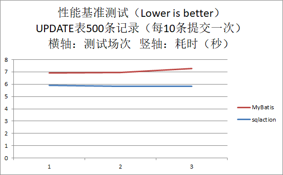
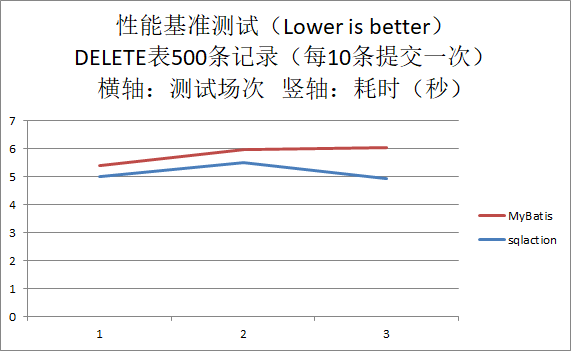

sqlaction - 自动生成JDBC代码的数据库持久层工具
=============================================

<!-- TOC -->

- [1. 概述](#1-概述)
- [2. 一个DEMO](#2-一个demo)
    - [2.1. 建表DDL](#21-建表ddl)
    - [2.2. 新建JAVA项目](#22-新建java项目)
    - [2.3. 在包目录中执行`sqlaction`工具](#23-在包目录中执行sqlaction工具)
    - [2.4. 到目前为止，一行JAVA代码都没写，现在开始写应用代码](#24-到目前为止一行java代码都没写现在开始写应用代码)
    - [2.5. 执行](#25-执行)
- [3. 使用参考](#3-使用参考)
    - [3.1. 开发流程](#31-开发流程)
    - [3.2. 配置文件`dbserver.conf.json`](#32-配置文件dbserverconfjson)
    - [3.3. 配置文件`sqlaction.conf.json`](#33-配置文件sqlactionconfjson)
    - [3.4. 自动生成规则](#34-自动生成规则)
    - [3.5. 元配置](#35-元配置)
        - [3.5.1. 自定义SQL动作方法名](#351-自定义sql动作方法名)
        - [3.5.2. 自动返回自增主键值](#352-自动返回自增主键值)
        - [3.5.3. 拦截器](#353-拦截器)
            - [3.5.3.1. SQL拦截器](#3531-sql拦截器)
- [4. 为什么这么设计？](#4-为什么这么设计)
- [5. 与MyBatis的开发量比较](#5-与mybatis的开发量比较)
- [6. 与MyBatis的性能比较](#6-与mybatis的性能比较)
    - [6.1. 准备`sqlaction`](#61-准备sqlaction)
    - [6.2. 准备`MyBatis`](#62-准备mybatis)
    - [6.3. 测试案例](#63-测试案例)
    - [6.4. 测试结果](#64-测试结果)
- [7. 后续开发](#7-后续开发)
- [8. 关于本项目](#8-关于本项目)
- [9. 关于作者](#9-关于作者)

<!-- /TOC -->

# 1. 概述

厌烦了`MyBatis`和`JPA`(`Hibernate`)的冗余配置和繁琐使用，以及XML拷来拷去，写那么多Mapper要是直接用JDBC早就写完了，如果使用一个框架/工具比不使用而带来更多的心智负担，那还不如不用。其实，直接使用JDBC还是蛮干净和高性能的，只要解决其三个痛点：

1. 手工编写数据库表实体类。
1. 手工编写大量setString和getString代码，尤其还要人工保证字段序号递增。
1. 因为直接写SQL，涉及不同DBMS的SQL方言时，移植性不好，比如分页查询。

能否造一个更好的轮子？

于是，我花了十多个晚上，结合之前在C技术栈中的设计和经验，结合JAVA特点，写了sqlaction。

`sqlaction`是自动生成JDBC代码的数据库持久层工具，它为应用提供了类似`MyBatis`和`Hibernate`操作数据库能力，但更轻量级和几乎消除了所有的手工冗余编码，提高开发效率，也易于与其它框架搭配使用。`sqlaction`读取数据库中的表结构元信息和少量配置文件信息（SQL），自动生成数据库表实体类，自动生成基于JDBC的SQL动作方法代码，自动生成拦截器框架等代码，应用调用其自动生成的代码就能极其快捷的操作数据库，同时还拥有JDBC的高性能，更重要的是开发者能直接看到底层操作代码，增加自主可控，没有低效的反射，没有复杂的热修改字节码，没有庞大笨重的隐藏核心。

# 2. 一个DEMO

放一个DEMO感受一下：

## 2.1. 建表DDL

`ddl.sql`

```
CREATE TABLE `sqlaction_demo` (
  `id` int(11) NOT NULL AUTO_INCREMENT COMMENT '编号',
  `name` varchar(32) COLLATE utf8mb4_bin NOT NULL COMMENT '名字',
  `address` varchar(128) COLLATE utf8mb4_bin DEFAULT NULL COMMENT '地址',
  PRIMARY KEY (`id`),
  KEY `sqlaction_demo` (`name`)
) ENGINE=InnoDB AUTO_INCREMENT=6 DEFAULT CHARSET=utf8mb4 COLLATE=utf8mb4_bin
```

## 2.2. 新建JAVA项目

只依赖数据库连接库和作者另一个JSON解析器`okjson`，引入`mysql-connector-java-X.Y.Z.jar`、`okjson-0.0.9.0.jar`。

建立包目录，在包目录或上级某一级目录中创建数据库连接配置文件`dbserver.conf.json`，工具会从执行目录开始往上查找，只要某一级目录中存在这个配置文件即可。

```
{
	"driver" : "com.mysql.jdbc.Driver" ,
	"url" : "jdbc:mysql://127.0.0.1:3306/calvindb?serverTimezone=GMT" ,
	"user" : "calvin" ,
	"pwd" : "calvin"
}
```

在包目录或上级某一级目录中创建SQL动作配置文件`sqlaction.conf.json`，工具会从执行目录开始往上查找，只要某一级目录中存在这个配置文件即可。

```
{
	"database" : "calvindb" ,
	"tables" : [
		{
			"table" : "sqlaction_demo" ,
			"sqlactions" : [
				"SELECT * FROM sqlaction_demo" ,
				"SELECT * FROM sqlaction_demo WHERE name=?" ,
				"INSERT INTO sqlaction_demo" ,
				"UPDATE sqlaction_demo SET address=? WHERE name=? @@METHOD(updateAddressByName)" ,
				"DELETE FROM sqlaction_demo WHERE name=?"
			]
		}
	] ,
	"javaPackage" : "xyz.calvinwilliams.sqlaction.demo"
}
```

## 2.3. 在包目录中执行`sqlaction`工具

我把执行命令行包成批处理文件后执行，欢迎懂`Eclipse`插件开发的同学帮我写个插件 :)

`pp.bat`

```
java -Dfile.encoding=UTF-8 -classpath "D:\Work\mysql-connector-java-8.0.15\mysql-connector-java-8.0.15.jar;%USERPROFILE%\.m2\repository\xyz\calvinwilliams\okjson\0.0.9.0\okjson-0.0.9.0.jar;%USERPROFILE%\.m2\repository\xyz\calvinwilliams\sqlaction\0.2.1.0\sqlaction-0.2.1.0.jar" xyz.calvinwilliams.sqlaction.SqlActionGencode
pause
```

注意：使用`Maven`管理的项目，在添加`sqlaction`依赖声明后，`maven`会自动下载`sqlaction`以及其依赖`okjson`的jar到`C:\User\用户名\.m2\repository\xyz\calvinwilliams\`下。`sqlaction`依赖声明见最后面“关于本项目”章节。

执行pp.bat，工具`sqlaction`会从执行目录开始往上查找读入`dbserver.conf.json`和`sqlaction.conf.json`并自动生成所有代码。

```
//////////////////////////////////////////////////////////////////////////////
/// sqlaction v0.0.8.0
/// Copyright by calvin<calvinwilliams@163.com,calvinwilliams@gmail.com>
//////////////////////////////////////////////////////////////////////////////
--- dbserverConf ---
  dbms[mysql]
driver[com.mysql.jdbc.Driver]
   url[jdbc:mysql://127.0.0.1:3306/calvindb?serverTimezone=GMT]
  user[calvin]
   pwd[calvin]
--- sqlactionConf ---
 database[calvindb]
        table[sqlaction_demo]
                sqlaction[SELECT * FROM sqlaction_demo]
                sqlaction[SELECT * FROM sqlaction_demo WHERE name=?]
                sqlaction[INSERT INTO sqlaction_demo]
                sqlaction[UPDATE sqlaction_demo SET address=? WHERE name=? @@METHOD(updateAddressByName)]
                sqlaction[DELETE FROM sqlaction_demo WHERE name=?]
SqlActionTable.getTableInDatabase[sqlaction_demo] ...
...
...
...
*** NOTICE : Write SqlactionDemoSAO.java completed!!!
```

如果没有出现`*** ERROR : ...`说明工具执行成功，在执行所在目录中自动生成了一个JAVA源代码文件

`SqlactionDemoSAO.java`
```
// This file generated by sqlaction v0.2.1.0

package xyz.calvinwilliams.sqlaction.demo;

import java.math.*;
import java.util.*;
import java.sql.Time;
import java.sql.Timestamp;
import java.sql.Connection;
import java.sql.Statement;
import java.sql.PreparedStatement;
import java.sql.ResultSet;

public class SqlactionDemoSAO {

	int				id ; // 编号
	String			name ; // 名字
	String			address ; // 地址

	int				_count_ ; // defining for 'SELECT COUNT(*)'

	// SELECT * FROM sqlaction_demo
	public static int SELECT_ALL_FROM_sqlaction_demo( Connection conn, List<SqlactionDemoSAO> sqlactionDemoListForSelectOutput ) throws Exception {
		Statement stmt = conn.createStatement() ;
		ResultSet rs = stmt.executeQuery("SELECT * FROM sqlaction_demo") ;
		while( rs.next() ) {
			SqlactionDemoSAO sqlactionDemo = new SqlactionDemoSAO() ;
			sqlactionDemo.id = rs.getInt( 1 ) ;
			sqlactionDemo.name = rs.getString( 2 ) ;
			sqlactionDemo.address = rs.getString( 3 ) ;
			sqlactionDemoListForSelectOutput.add(sqlactionDemo) ;
		}
		return sqlactionDemoListForSelectOutput.size();
	}

	// SELECT * FROM sqlaction_demo WHERE name=?
	public static int SELECT_ALL_FROM_sqlaction_demo_WHERE_name_E_( Connection conn, List<SqlactionDemoSAO> sqlactionDemoListForSelectOutput, String _1_name ) throws Exception {
		PreparedStatement prestmt = conn.prepareStatement("SELECT * FROM sqlaction_demo WHERE name=?") ;
		prestmt.setString( 1, _1_name );
		ResultSet rs = prestmt.executeQuery() ;
		while( rs.next() ) {
			SqlactionDemoSAO sqlactionDemo = new SqlactionDemoSAO() ;
			sqlactionDemo.id = rs.getInt( 1 ) ;
			sqlactionDemo.name = rs.getString( 2 ) ;
			sqlactionDemo.address = rs.getString( 3 ) ;
			sqlactionDemoListForSelectOutput.add(sqlactionDemo) ;
		}
		return sqlactionDemoListForSelectOutput.size();
	}

	// INSERT INTO sqlaction_demo (name,address) VALUES (?,?)
	public static int INSERT_INTO_sqlaction_demo( Connection conn, SqlactionDemoSAO sqlactionDemo ) throws Exception {
		PreparedStatement prestmt = conn.prepareStatement("INSERT INTO sqlaction_demo (name,address) VALUES (?,?)") ;
		prestmt.setString( 1, sqlactionDemo.name );
		prestmt.setString( 2, sqlactionDemo.address );
		return prestmt.executeUpdate() ;
	}

	// UPDATE sqlaction_demo SET address=? WHERE name=? 
	public static int updateAddressByName( Connection conn, String _1_address_ForSetInput, String _1_name_ForWhereInput ) throws Exception {
		PreparedStatement prestmt = conn.prepareStatement("UPDATE sqlaction_demo SET address=? WHERE name=? ") ;
		prestmt.setString( 1, _1_address_ForSetInput );
		prestmt.setString( 2, _1_name_ForWhereInput );
		return prestmt.executeUpdate() ;
	}

	// DELETE FROM sqlaction_demo WHERE name=?
	public static int DELETE_FROM_sqlaction_demo_WHERE_name_E_( Connection conn, String _1_name ) throws Exception {
		PreparedStatement prestmt = conn.prepareStatement("DELETE FROM sqlaction_demo WHERE name=?") ;
		prestmt.setString( 1, _1_name );
		return prestmt.executeUpdate() ;
	}
}
```

`SqlactionDemoSAU.java`
```
// This file generated by sqlaction v0.2.1.0

package xyz.calvinwilliams.sqlaction;

import java.math.*;
import java.util.*;
import java.sql.Time;
import java.sql.Timestamp;
import java.sql.Connection;
import java.sql.Statement;
import java.sql.PreparedStatement;
import java.sql.ResultSet;

public class SqlactionDemoSAU {

}
```

工具`sqlaction`内部处理流程如下：

1. 首先查找执行目录中的数据库连接配置文件`dbserver.conf.json`，如果没有找到就迭代往上级目录继续找，从该配置文件中获得数据库连接配置信息。然后以相同的查找逻辑读取`sqlaction.conf.json`获得数据库名、表列表、以及每张表需要执行的SQL语句列表等信息。配置文件往上查找机制是为了灵活适应不同规模项目目录的规划。
2. 连接数据库，读取表结构元信息，每张表对应自动生成数据库表实体类和SQL动作方法JAVA源代码文件`XxxSao.java`和用户自定义代码文件`XxxSau.java`，，sqlaction配置文件中的每一条SQL自动解析生成基于JDBC的JAVA方法，从此再也不用手工写JDBC代码了！

## 2.4. 到目前为止，一行JAVA代码都没写，现在开始写应用代码

`Demo.java`

```
package xyz.calvinwilliams.sqlaction.demo;

import java.sql.Connection;
import java.sql.DriverManager;
import java.sql.SQLException;
import java.util.LinkedList;
import java.util.List;

public class Demo {

	public static void main(String[] args) {
		Connection				conn = null ;
		List<SqlactionDemoSAO>	sqlactionDemoList = null ;
		SqlactionDemoSAO		sqlactionDemo = null ;
		SqlactionDemoSAO		sqlactionDemoForSetInput = null ;
		SqlactionDemoSAO		sqlactionDemoForWhereInput = null ;
		int						nret = 0 ;

		// Connect to database
		try {
			Class.forName( "com.mysql.jdbc.Driver" );
			conn = DriverManager.getConnection( "jdbc:mysql://127.0.0.1:3306/calvindb?serverTimezone=GMT", "calvin", "calvin" ) ;
		} catch (ClassNotFoundException e1) {
			e1.printStackTrace();
		} catch (SQLException e) {
			e.printStackTrace();
		}
		
		try {
			conn.setAutoCommit(false);
			
			// Delete records with name
			nret = SqlactionDemoSAO.DELETE_FROM_sqlaction_demo_WHERE_name_E_( conn, "Calvin" ) ;
			if( nret < 0 ) {
				System.out.println( "SqlactionDemoSAO.DELETE_FROM_sqlaction_demo_WHERE_name_E_ failed["+nret+"]" );
				conn.rollback();
				return;
			} else {
				System.out.println( "SqlactionDemoSAO.DELETE_FROM_sqlaction_demo_WHERE_name_E_ ok , rows["+nret+"] effected" );
			}
			
			// Insert record
			sqlactionDemo = new SqlactionDemoSAO() ;
			sqlactionDemo.name = "Calvin" ;
			sqlactionDemo.address = "My address" ;
			nret = SqlactionDemoSAO.INSERT_INTO_sqlaction_demo( conn, sqlactionDemo ) ;
			if( nret < 0 ) {
				System.out.println( "SqlactionDemoSAO.INSERT_INTO_sqlaction_demo failed["+nret+"]" );
				conn.rollback();
				return;
			} else {
				System.out.println( "SqlactionDemoSAO.INSERT_INTO_sqlaction_demo ok" );
			}
			
			// Update record with name
			nret = SqlactionDemoSAO.updateAddressByName( conn, "My address 2", "Calvin" ) ;
			if( nret < 0 ) {
				System.out.println( "SqlactionDemoSAO.updateAddressByName failed["+nret+"]" );
				conn.rollback();
				return;
			} else {
				System.out.println( "SqlactionDemoSAO.updateAddressByName ok , rows["+nret+"] effected" );
			}
			
			// Query records
			sqlactionDemoList = new LinkedList<SqlactionDemoSAO>() ;
			nret = SqlactionDemoSAO.SELECT_ALL_FROM_sqlaction_demo( conn, sqlactionDemoList ) ;
			if( nret < 0 ) {
				System.out.println( "SqlactionDemoSAO.SELECT_ALL_FROM_sqlaction_demo failed["+nret+"]" );
				conn.rollback();
				return;
			} else {
				System.out.println( "SqlactionDemoSAO.SELECT_ALL_FROM_sqlaction_demo ok" );
				for( SqlactionDemoSAO r : sqlactionDemoList ) {
					System.out.println( "    id["+r.id+"] name["+r.name+"] address["+r.address+"]" );
				}
			}
			
			conn.commit();
		} catch(Exception e) {
			try {
				conn.rollback();
			} catch (Exception e2) {
				return;
			}
		}
		
		return;
	}

}
```

## 2.5. 执行

```
SqlactionDemoSAO.DELETE_FROM_sqlaction_demo_WHERE_name_E_ ok , rows[1] effected
SqlactionDemoSAO.INSERT_INTO_sqlaction_demo ok
SqlactionDemoSAO.UPDATE_sqlaction_demo_SET_address_E_WHERE_name_E_ ok , rows[1] effected
SqlactionDemoSAO.SELECT_ALL_FROM_sqlaction_demo ok
    id[15] name[Calvin] address[My address 2]
```

总结：

对表的增删改查只需调用前面自动生成的数据库表实体类中的方法即可，而且底层执行代码可随时查看，没有什么秘密，没有什么高深的技术。

工具`sqlaction`只在开发阶段使用，与运行阶段无关，说到底只是在应用与JDBC之间自动生成了薄薄的一层代码而已，把大量手工冗余代码都自动生成了，让开发者节省大量时间而去关注业务，减少大量机械操作减轻心智负担，提高生产力，早点做完工作回家抱女盆友/老婆 :)

# 3. 使用参考

## 3.1. 开发流程

```
                                        sqlaction
dbserver.conf.json、sqlaction.conf.json ---------> XxxSao.java(Auto-gen JDBC code)、XxxSau.java(Custom code) --\
                                                                                                                ---> Zzz.jar
                                                                                                    Yyy.java --/
```

## 3.2. 配置文件`dbserver.conf.json`

```
{
	"driver" : "com.mysql.jdbc.Driver" ,
	"url" : "jdbc:mysql://127.0.0.1:3306/calvindb?serverTimezone=GMT" ,
	"user" : "root" ,
	"pwd" : "root" ,
	"userDefineDataTypes" : [
		{ "source":"decimal,*,12,2" , "redefine":"double,*,14,*" }
	]
}
```

数据库连接配置文件`dbserver.conf.json`配置了工具`sqlaction`执行所需数据库层面上的信息：

`deiver` : DBMS驱动类。

`url` : DBMS连接配置串。

`user` : DBMS连接用户名。

`pwd` : DBMS连接密码。

`userDefineDataTypes` : 自定义字段类型转换，比如数据库中的类型`DECIMAL(12,2)`映射到JAVA变量类型是`BigDecimal`，但在某应用系统中希望是`double`，可以在这个配置集中在正式转换前把`DECIMAL(12,2)`强制转换成`DOUBLE`，那么正式转换时`DOUBLE`会映射成JAVA变量类型`double`。

数据库字段类型与sqlaction的JAVA变量类型映射表：

| MySQL字段类型 | sqlaction的JAVA变量类型 |
|---|---|
| bit | boolean |
| tinyint | byte |
| smallint | short |
| mediumint | int |
| int | int |
| bigint | long |
| real | float |
| float | double |
| double | double |
| decimal | BigDecimal |
| numeric | BigDecimal |
| char | String |
| varchar | String |
| date | java.sql.Date |
| time | java.sql.Time |
| datetime | java.sql.Date |
| timestamp | timestamp |
| year | java.sql.Date |
| binary | byte[] |
| varbinary | byte[] |
| blob | byte[] |
| tinyblob | byte[] |
| mediumblob | byte[] |
| longblob | byte[] |
| (other) | String |

注意：数据库连接配置文件`dbserver.conf.json`一般放在项目根目录里，以便于所有子项目都能使用到。

注意：读取JSON配置文件使用到了我的另一个开源项目：okjson，一个简洁易用的JSON解析器/生成器，只有一个类文件，可以很方便的融合到其它项目中。

## 3.3. 配置文件`sqlaction.conf.json`

```
{
	"database" : "calvindb" ,
	"tables" : [
		{
			"table" : "user" ,
			"sqlactions" : [
				"SELECT * FROM user" ,
				"SELECT * FROM user WHERE name=?" ,
				"SELECT name,address FROM user WHERE age<=? AND gender=?" ,
				"SELECT * FROM user ORDER BY name DESC" ,
				"SELECT gender,count(*) FROM user GROUP BY gender" ,
				"INSERT INTO user" ,
				"UPDATE user SET level=?" ,
				"UPDATE user SET address='calvin address',level=10 WHERE name='Calvin'" ,
				"UPDATE user SET level=? WHERE age>? AND gender=?" ,
				"DELETE FROM user" ,
				"DELETE FROM user WHERE name='Calvin'" ,
				"DELETE FROM user WHERE age<>? AND gender<>?"
			]
		} ,
		{
			"table" : "user_order" ,
			"sqlactions" : [
				"SELECT /* blablabla~ */ * FROM user_order @@STATEMENT_INTERCEPTOR()" ,
				"SELECT * FROM user_order WHERE user_id=?" ,
				"SELECT user.name,user.address,user_order.item_name,user_order.amount,user_order.total_price
					FROM user,user_order
					WHERE user.name=? AND user.id=user_order.user_id
					@@METHOD(queryUserAndOrderByName) @@STATEMENT_INTERCEPTOR(statementInterceptorForQueryUserAndOrderByName)" ,
				"SELECT u.name,u.address,o.item_name,o.amount,o.total_price FROM user u,user_order o WHERE u.name=? AND u.id=o.user_id" ,
				"INSERT INTO user_order" ,
				"UPDATE user_order SET total_price=? WHERE user_id=?" ,
				"DELETE FROM user_order"
			]
		}
	] ,
	"javaPackage" : "xyz.calvinwilliams.sqlaction.test"
}
```

SQL动作配置文件`sqlaction.conf.json`配置了工具`sqlaction`执行所需表层面上的信息：

`database` : 数据库名。

`tables` : 表列表。

`table` : 表名。

`sqlactions` : SQL语句列表。注意最后一条SQL后不带','以符合JSON规范。

`javaPackage` : JAVA包名，自动生成JAVA类文件时放在最上面。

目前`sqlaction`支持的SQL标准：

**查询**
```
SELECT [*|[table_name.|table_alias_name.]column_name[,...][,COUNT(*)]]
    [ /* hint */ ]
    FROM table_name [table_alias_name],...
    [ WHERE [table_name.|table_alias_name.]column_name [=|<>|>|>=|<|<=] [?|const|[table_name2.|table_alias_name2.]column_name2] [AND ...] ]
    [ GROUP BY [table_name.|table_alias_name.]column[,[table_name2.|table_alias_name.]column2][,...] ]
    [ HAVING ... ]
    [ ORDER BY column[,...] [ASC|DESC] ]
    ...
```

**插入**
```
INSERT INTO table_name
```

**更新**
```
UPDATE table_name
    SET column_name = [?|const|column_name2] [,...]
    [ WHERE column_name [=|<>|>|>=|<|<=] [const|column_name2] [AND ...] ]
```

**删除**
```
DELETE FROM table_name
    [ WHERE column_name [=|<>|>|>=|<|<=] [const|column_name2] [AND ...] ]
```

注意：数据库连接配置文件`sqlaction.conf.json`一般放在JAVA包目录里，以便于自动生成的类打包。

## 3.4. 自动生成规则

工具`sqlaction`读取数据库中的表结构元信息和SQL动作配置文件`sqlaction.conf.json`，在执行目录里自动生成JAVA类源代码文件`XxxSao.java`和`XxxSau.java`。类源代码文件`XxxSao.java`包含数据库表实体信息（字段映射属性）和SQL动作对应方法，每次运行`sqlaction`都会刷新该类源代码文件，所以不要修改此文件。类源代码文件`XxxSau.java`包含用户自定义代码，首次运行`sqlaction`会生成该类源代码文件，所以用户增加的代码可写到此文件中。

数据库表字段映射属性由数据库中的表结构元信息映射生成，转换规则见前面的数据库字段类型与sqlaction的JAVA变量类型映射表。如果DDL中有comment，则在表实体类的对应属性后面加注释。

SQL动作对应缺省方法名为SQL转换而来，具体算法为所有非字母数字字符都转换为'\_'，合并多个'\_'为一个。

方法前的注释是原SQL，以便于对照和定位。

方法的第一个参数是数据库连接对象，可以和连接池框架结合使用。

如果SQL动作涉及输出，自动生成的代码在SQL执行后，根据解析出来的输出项（SELECT）自动生成getString等代码，方法参数中也要求给予以便于输出，按表实体类列表对象排列，SQL JOIN多表对应多个表实体类列表对象。

如果SQL动作涉及输入，自动生成的代码将使用JDBC的prepareStatement，并根据解析出来的输入项（SET、WHERE）自动生成setString等代码，方法参数中也要求给予以便于输入，按字段名排列。如果没有输入则使用createStatement。

如果是查询SQL，JAVA方法返回表实体类列表大小。如果是插入、更新、删除SQL，JAVA方法返回受影响记录条数。

表实体类属性列表中额外有"int _count_ ;"，用于查询COUNT(*)时存储输出结果用。

插入方法中会自动识别忽略自增类型。

就这么简单！

## 3.5. 元配置

SQL中可追加一些以"@@"开头的元配置以实现一些额外的功能。

### 3.5.1. 自定义SQL动作方法名

允许自定义SQL动作方法名，在SQL动作配置中追加元信息"@@METHOD(自定义方法名)"，如：
```
SELECT user.name,user.address,user_order.item_name,user_order.amount,user_order.total_price FROM user,user_order WHERE user.name=? AND user.id=user_order.user_id @@METHOD(queryUserAndOrderByName)
```

### 3.5.2. 自动返回自增主键值

MySQL的自增主键值在INSERT时自动取得，其DDL如下：
```
CREATE TABLE `user` (
  `id` int(11) NOT NULL AUTO_INCREMENT COMMENT '编号',
  ...
```

有些数据库没有自增功能，自增主键值从序列中取得，`sqlaction`为了统一其访问抽象，提供元配置"@@SELECTKEY"，在`sqlaction.conf.json`配置如下：
```
{
	"database" : "calvindb" ,
	"tables" : [
		{
			"table" : "user" ,
			"sqlactions" : [
				...
				"INSERT INTO user @@SELECTKEY(user_id_seq)" ,
```

* 当在MySQL等有自增功能的DBMS中，`sqlaction`处理`sqlaction.conf.json`自动生成的JDBC代码中，在INSERT操作完后，追加生成调用"SELECT LAST_INSERT_ID()"的代码，取得自增主键值，赋值到主键字段中；
* 当在Oracle环境等没有自增功能但有序列的DBMS中，`sqlaction`处理`sqlaction.conf.json`自动生成的JDBC代码中，在INSERT操作前，调用"select user_id_seq.nextval from dual;"取得序列值，赋值到主键字段中，然后再INSERT；

### 3.5.3. 拦截器

#### 3.5.3.1. SQL拦截器

如果需要SQL真正执行前微调一下SQL（如分库分表修改hint），可加入拦截器"@@STATEMENT_INTERCEPTOR(拦截器方法名，填空则自动生成一个)"，配置示例：
```
SELECT /* blablabla~ */ * FROM user_order @@STATEMENT_INTERCEPTOR()
```
或自定义拦截器方法名
```
SELECT u.name,u.address,o.item_name,o.amount,o.total_price FROM user u,user_order o WHERE u.name=? AND u.id=o.user_id @@STATEMENT_INTERCEPTOR(statementInterceptorForQueryUserAndOrderByName)
```
在另一个JAVA自动生成源码文件XxxSau.java中出现
```
public class UserOrderSAU {
	
	// SELECT /* blablabla~ */ * FROM user_order 
	public static String STATEMENT_INTERCEPTOR_for_SELECT_HT_blablabla_TH_ALL_FROM_user_order_( String statementSql ) {
		return statementSql;
	}
	
	// SELECT user.name,user.address,user_order.item_name,user_order.amount,user_order.total_price
	// 					FROM user,user_order
	// 					WHERE user.name=? AND user.id=user_order.user_id
	public static String statementInterceptorForQueryUserAndOrderByName( String statementSql ) {
		return statementSql;
	}

}
```
开发者可微调SQL，新SQL作为返回值返回。

由于`XxxSau.java`只有在首次执行`sqlaction`才会自动生成，后面增加的拦截器方法框架源代码虽然不会自动添加到`XxxSau.java`中，但会作为注释出现在`XxxSao.java`中，方便开发者复制粘贴过去。

# 4. 为什么这么设计？

数据库应用接口层框架/工具对于表结构的配置源的有两派思路，一派是定义在配置文件中，好处是可以做不同DBMS的统一规范，如同一种数据类型的统一表达，坏处是与数据库之间同步较麻烦，另一派是定义在数据库中，需要用时读数据库中的元信息，好处是可以利用数据库设计工具，图形化界面管理表结构，还能自动生成E-R图，坏处是不同DBMS存在标准差异。`sqlaction`采用后一派思路，在数据类型与JAVA属性类型之间建立多DBMS映射表来解决标准差异。

很多数据库持久化框架对于SQL动作都定义了一套自己的动作语法标准，`sqlaction`坚持采用原SQL来配置，减少开发人员学习负担。在分页查询等差异问题上，`sqlaction`定义一套兼容标准来统一SQL表达。

`sqlaction`的SQL集合都放在一个文件中，便于审计表操作，如很容易查出是否有操作游离于索引之外，但生产部署又不需要其SQL动作配置文件，防止被人篡改。

`sqlaction`坚持采用最小化配置原则，规避一切冗余配置，尽力减少开发人员工作量，推荐用缺省值工作，如果需要自定义再提供额外的配置，如SQL动作方法名默认情况下无需配置，按照缺省规则就能自动根据SQL生成一个含义清晰的名字，开发人员无须为每个SQL动作必须配置方法名，甚至无需繁复的XML替代JAVA语言定义方法的输入输出参数（MyBatis），而且配置错误时只有在运行期才告知。

`sqlaction`朴素，无需MyBatis或Hibernate那么复杂、炫耀技术之嫌；`sqlaction`简单，只是代替手工而自动生成JDBC代码段落，没有运行时框架，不做其它事情（如连接池、事务控制等），保持代码架构简单、透明、可控和高效，便于和其它数据库框架/工具协同工作；`sqlaction`对开发友好，大部分错误都能在预处理期或编译期发现和提示，而不像某些“高端”框架只有到了运行期才警示开发问题。

简洁就是优秀工具的特质，而不是为了解决一种复杂性而带来另一种复杂性。

# 5. 与MyBatis的开发量比较

<table>
	<tr>
		<td>MyBatis</td>
		<td>sqlaction</td>
	</tr>
	<tr>
		<td colspan="2">每个项目手工开发量<td>
	</tr>
	<tr>
		<td>
			<xmp>
配置数据库连接信息
<?xml version="1.0" encoding="UTF-8"?>
<!DOCTYPE configuration PUBLIC "-//mybatis.org//DTD Config 3.0//EN" "http://mybatis.org/dtd/mybatis-3-config.dtd">
<configuration>
	<settings>
		<setting name="cacheEnabled" value="false" />
	</settings>
	<environments default="development">
		<environment id="development">
			<transactionManager type="JDBC"></transactionManager>
			<dataSource type="POOLED">
				<property name="driver" value="com.mysql.jdbc.Driver" />
				<property name="url" value="jdbc:mysql://127.0.0.1:3306/calvindb?serverTimezone=GMT" />
				<property name="username" value="calvin" />
				<property name="password" value="calvin" />
			</dataSource>
		</environment>
	</environments>
	<mappers>
		<mapper resource="mybatis-mapper.xml" />
	</mappers>
</configuration>
			</xmp>
		</td>
		<td>
			<xmp>
配置数据库连接信息
{
	"driver" : "com.mysql.jdbc.Driver" ,
	"url" : "jdbc:mysql://127.0.0.1:3306/calvindb?serverTimezone=GMT" ,
	"user" : "calvin" ,
	"pwd" : "calvin"
}
			</xmp>
		</td>
	</tr>
	<tr>
		<td colspan="2">每张表手工开发量<td>
	</tr>
	<tr>
		<td>
			<xmp>
编写实体类
package xyz.calvinwilliams.mybatis.benchmark;

import java.math.*;

public class SqlactionBenchmarkSAO {

	int				id ; // 编号
	String			name ; // 英文名
	String			name_cn ; // 中文名
	BigDecimal		salary ; // 薪水
	java.sql.Date	birthday ; // 生日
}
			</xmp>
		</td>
		<td>
			（sqlaction自动生成）
		</td>
	</tr>
	<tr>
		<td>
			<xmp>
配置表Mapper信息
<?xml version="1.0" encoding="UTF-8"?>
<!DOCTYPE mapper PUBLIC "-//mybatis.org//DTD Mapper 3.0//EN" "http://mybatis.org/dtd/mybatis-3-mapper.dtd" >
<mapper namespace="xyz.calvinwilliams.mybatis.benchmark.SqlactionBenchmarkSAOMapper">
	<insert id="insertOne" parameterType="xyz.calvinwilliams.mybatis.benchmark.SqlactionBenchmarkSAO">
		INSERT INTO sqlaction_benchmark (name,name_cn,salary,birthday) VALUES( #{name}, #{name_cn}, #{salary}, #{birthday} )
	</insert>
	<update id="updateOneByName" parameterType="xyz.calvinwilliams.mybatis.benchmark.SqlactionBenchmarkSAO">
		UPDATE sqlaction_benchmark SET salary=#{salary} WHERE name=#{name}
	</update>
	<select id="selectOneByName" parameterType="java.lang.String" resultType="xyz.calvinwilliams.mybatis.benchmark.SqlactionBenchmarkSAO" flushCache="true" useCache="false">
		SELECT * FROM sqlaction_benchmark WHERE name=#{name}
	</select>
	<select id="selectAll" resultType="xyz.calvinwilliams.mybatis.benchmark.SqlactionBenchmarkSAO" flushCache="true" useCache="false">
		SELECT * FROM sqlaction_benchmark
	</select>
	<delete id="deleteOneByName" parameterType="java.lang.String">
		DELETE FROM sqlaction_benchmark WHERE name=#{name}
	</delete>
	<delete id="deleteAll">
		DELETE FROM sqlaction_benchmark
	</delete>
</mapper>
			</xmp>
		</td>
		<td>
			<xmp>
配置表动作信息
{
	"database" : "calvindb" ,
	"tables" : [
		{
			"table" : "sqlaction_benchmark" ,
			"sqlactions" : [
				"INSERT INTO sqlaction_benchmark" ,
				"UPDATE sqlaction_benchmark SET salary=? WHERE name=?" ,
				"SELECT * FROM sqlaction_benchmark WHERE name=?" ,
				"SELECT * FROM sqlaction_benchmark" ,
				"DELETE FROM sqlaction_benchmark WHERE name=?" ,
				"DELETE FROM sqlaction_benchmark"
			]
		}
	] ,
	"javaPackage" : "xyz.calvinwilliams.sqlaction.benchmark"
}
			</xmp>
		</td>
	</tr>
	<tr>
		<td>
			<xmp>
编写接口类
package xyz.calvinwilliams.mybatis.benchmark;

import java.util.*;

public interface SqlactionBenchmarkSAOMapper {
	public void insertOne(SqlactionBenchmarkSAO sqlactionBenchmark);
	public void updateOneByName(SqlactionBenchmarkSAO sqlactionBenchmark);
	public SqlactionBenchmarkSAO selectOneByName(String name);
	public List<SqlactionBenchmarkSAO> selectAll();
	public void deleteOneByName(String name);
	public void deleteAll();
}
			</xmp>
		</td>
		<td>
			（无）
		</td>
	</tr>
	<tr>
		<td>
			（无）
		</td>
		<td>
			<xmp>
执行`sqlaction`，处理SQL动作配置
java -Dfile.encoding=UTF-8 -classpath "D:\Work\sqlaction\sqlaction.jar;D:\Work\mysql-connector-java-8.0.15\mysql-connector-java-8.0.15.jar" xyz.calvinwilliams.sqlaction.gencode.SqlActionGencode
pause
			</xmp>
		</td>
	</tr>
</table>

# 6. 与MyBatis的性能比较

由于`sqlaction`自动生成的JDBC代码，与手工代码基本无异，没有低效的反射，没有多坑的热修改字节码，所以稳定性和运行性能都非常出色，下面是`sqlaction`与`MyBatis`的性能测试。

CPU : Intel Core i5-7500 3.4GHz 3.4GHz
内存 : 16GB
操作系统 : WINDOWS 10
JAVA开发工具 : Eclipse 2018-12
数据库 : MySQL 8.0.15 Community Server
数据库连接地址 : 127.0.0.1:3306

DDL

```
CREATE TABLE `sqlaction_benchmark` (
  `id` int(11) NOT NULL AUTO_INCREMENT COMMENT '编号',
  `name` varchar(32) COLLATE utf8mb4_bin NOT NULL COMMENT '英文名',
  `name_cn` varchar(128) COLLATE utf8mb4_bin NOT NULL COMMENT '中文名',
  `salary` decimal(12,2) NOT NULL COMMENT '薪水',
  `birthday` date NOT NULL COMMENT '生日',
  PRIMARY KEY (`id`)
) ENGINE=InnoDB AUTO_INCREMENT=42332 DEFAULT CHARSET=utf8mb4 COLLATE=utf8mb4_bin
```

## 6.1. 准备`sqlaction`

手工编写数据库连接配置文件`dbserver.conf.json`

```
{
	"driver" : "com.mysql.jdbc.Driver" ,
	"url" : "jdbc:mysql://127.0.0.1:3306/calvindb?serverTimezone=GMT" ,
	"user" : "calvin" ,
	"pwd" : "calvin"
}
```

手工编写SQL动作配置文件`sqlaction.conf.json`

```
{
	"database" : "calvindb" ,
	"tables" : [
		{
			"table" : "sqlaction_benchmark" ,
			"sqlactions" : [
				"INSERT INTO sqlaction_benchmark" ,
				"UPDATE sqlaction_benchmark SET salary=? WHERE name=?" ,
				"SELECT * FROM sqlaction_benchmark WHERE name=?" ,
				"SELECT * FROM sqlaction_benchmark" ,
				"DELETE FROM sqlaction_benchmark WHERE name=?" ,
				"DELETE FROM sqlaction_benchmark"
			]
		}
	] ,
	"javaPackage" : "xyz.calvinwilliams.sqlaction.benchmark"
}
```

运行工具`sqlaction`，自动生成`SqlactionBenchmarkSAO.java`

手工编写性能测试应用类`SqlActionBenchmarkCrud.java`

```
/*
 * sqlaction - SQL action object auto-gencode tool based JDBC for Java
 * author	: calvin
 * email	: calvinwilliams@163.com
 *
 * See the file LICENSE in base directory.
 */

package xyz.calvinwilliams.sqlaction.benchmark;

import java.math.BigDecimal;
import java.sql.Connection;
import java.sql.DriverManager;
import java.sql.SQLException;
import java.text.SimpleDateFormat;
import java.util.Date;
import java.util.LinkedList;
import java.util.List;

public class SqlActionBenchmarkCrud {

	public static void main(String[] args) {
		Connection					conn = null ;
		SqlactionBenchmarkSAO		sqlactionBenchmark ;
		List<SqlactionBenchmarkSAO>	sqlactionBenchmarkList ;
		long						beginMillisSecondstamp ;
		long						endMillisSecondstamp ;
		double						elpaseSecond ;
		long						i , j , k ;
		long						count , count2 , count3 ;
		int							rows = 0 ;
		
		// connect to database
		try {
			Class.forName( "com.mysql.jdbc.Driver" );
			conn = DriverManager.getConnection( "jdbc:mysql://127.0.0.1:3306/calvindb?serverTimezone=GMT", "calvin", "calvin" ) ;
		} catch (ClassNotFoundException e1) {
			e1.printStackTrace();
		} catch (SQLException e) {
			e.printStackTrace();
		}
		
		try {
			conn.setAutoCommit(false);
			
			sqlactionBenchmark = new SqlactionBenchmarkSAO() ;
			sqlactionBenchmark.name = "Calvin" ;
			sqlactionBenchmark.nameCn = "卡尔文" ;
			sqlactionBenchmark.salary = new BigDecimal(0) ;
			long time = System.currentTimeMillis() ;
			sqlactionBenchmark.birthday = new java.sql.Date(time) ;
			count = 500 ;
			count2 = 5 ;
			count3 = 1000 ;
			
			rows = SqlactionBenchmarkSAO.DELETE_FROM_sqlaction_benchmark( conn ) ;
			conn.commit();
			
			// benchmark for INSERT
			beginMillisSecondstamp = System.currentTimeMillis() ;
			for( i = 0 ; i < count ; i++ ) {
				sqlactionBenchmark.name = "Calvin"+i ;
				sqlactionBenchmark.nameCn = "卡尔文"+i ;
				rows = SqlactionBenchmarkSAO.INSERT_INTO_sqlaction_benchmark( conn, sqlactionBenchmark ) ;
				if( rows != 1 ) {
					System.out.println( "SqlactionBenchmarkSAO.INSERT_INTO_sqlaction_benchmark failed["+rows+"]" );
					return;
				}
				if( i % 10 == 0 ) {
					conn.commit();
				}
			}
			conn.commit();
			endMillisSecondstamp = System.currentTimeMillis() ;
			elpaseSecond = (endMillisSecondstamp-beginMillisSecondstamp)/1000.0 ;
			System.out.println( "All sqlaction INSERT done , count["+count+"] elapse["+elpaseSecond+"]s" );
			
			// benchmark for UPDATE
			beginMillisSecondstamp = System.currentTimeMillis() ;
			for( i = 0 ; i < count ; i++ ) {
				rows = SqlactionBenchmarkSAO.UPDATE_sqlaction_benchmark_SET_salary_E_WHERE_name_E_( conn, new BigDecimal(i), "Calvin"+i ) ;
				if( rows != 1 ) {
					System.out.println( "SqlactionBenchmarkSAO.UPDATE_sqlaction_benchmark_SET_salary_E_WHERE_name_E_ failed["+rows+"]" );
					return;
				}
				if( i % 10 == 0 ) {
					conn.commit();
				}
			}
			conn.commit();
			endMillisSecondstamp = System.currentTimeMillis() ;
			elpaseSecond = (endMillisSecondstamp-beginMillisSecondstamp)/1000.0 ;
			System.out.println( "All sqlaction UPDATE WHERE done , count["+count+"] elapse["+elpaseSecond+"]s" );
			
			// benchmark for SELECT ... WHERE ...
			beginMillisSecondstamp = System.currentTimeMillis() ;
			for( j = 0 ; j < count2 ; j++ ) {
				for( i = 0 ; i < count ; i++ ) {
					sqlactionBenchmarkList = new LinkedList<SqlactionBenchmarkSAO>() ;
					rows = SqlactionBenchmarkSAO.SELECT_ALL_FROM_sqlaction_benchmark_WHERE_name_E_( conn, sqlactionBenchmarkList, "Calvin"+i ) ;
					if( rows != 1 ) {
						System.out.println( "SqlactionBenchmarkSAO.SELECT_ALL_FROM_sqlaction_benchmark_WHERE_name_E_ failed["+rows+"]" );
						return;
					}
				}
			}
			endMillisSecondstamp = System.currentTimeMillis() ;
			elpaseSecond = (endMillisSecondstamp-beginMillisSecondstamp)/1000.0 ;
			System.out.println( "All sqlaction SELECT WHERE done , count2["+count2+"] count["+count+"] elapse["+elpaseSecond+"]s" );
			
			// benchmark for SELECT
			beginMillisSecondstamp = System.currentTimeMillis() ;
			for( k = 0 ; k < count3 ; k++ ) {
				sqlactionBenchmarkList = new LinkedList<SqlactionBenchmarkSAO>() ;
				rows = SqlactionBenchmarkSAO.SELECT_ALL_FROM_sqlaction_benchmark( conn, sqlactionBenchmarkList ) ;
				if( rows != count ) {
					System.out.println( "SqlactionBenchmarkSAO.SELECT_ALL_FROM_sqlaction_benchmark failed["+rows+"]" );
					return;
				}
			}
			endMillisSecondstamp = System.currentTimeMillis() ;
			elpaseSecond = (endMillisSecondstamp-beginMillisSecondstamp)/1000.0 ;
			System.out.println( "All sqlaction SELECT to LIST done , count3["+count3+"] elapse["+elpaseSecond+"]s" );
			
			// benchmark for DELETE
			beginMillisSecondstamp = System.currentTimeMillis() ;
			for( i = 0 ; i < count ; i++ ) {
				rows = SqlactionBenchmarkSAO.DELETE_FROM_sqlaction_benchmark_WHERE_name_E_( conn, "Calvin"+i ) ;
				if( rows != 1 ) {
					System.out.println( "SqlactionBenchmarkSAO.DELETE_FROM_sqlaction_benchmark_WHERE_name_E_ failed["+rows+"]" );
					return;
				}
				if( i % 10 == 0 ) {
					conn.commit();
				}
			}
			conn.commit();
			endMillisSecondstamp = System.currentTimeMillis() ;
			elpaseSecond = (endMillisSecondstamp-beginMillisSecondstamp)/1000.0 ;
			System.out.println( "All sqlaction DELETE WHERE done , count["+count+"] elapse["+elpaseSecond+"]s" );
		} catch(Exception e) {
			e.printStackTrace();
			try {
				conn.rollback();
			} catch (Exception e2) {
				e.printStackTrace();
				return;
			}
		} finally {
			try {
				conn.close();
			} catch (Exception e2) {
				e2.printStackTrace();
				return;
			}
		}
		
		return;
	}
}
```

## 6.2. 准备`MyBatis`

手工编写数据库连接配置文件`mybatis-config.xml`

```
<?xml version="1.0" encoding="UTF-8"?>
<!DOCTYPE configuration PUBLIC "-//mybatis.org//DTD Config 3.0//EN" "http://mybatis.org/dtd/mybatis-3-config.dtd">
<configuration>
	<settings>
		<setting name="cacheEnabled" value="false" />
	</settings>
	<environments default="development">
		<environment id="development">
			<transactionManager type="JDBC"></transactionManager>
			<dataSource type="POOLED">
				<property name="driver" value="com.mysql.jdbc.Driver" />
				<property name="url" value="jdbc:mysql://127.0.0.1:3306/calvindb?serverTimezone=GMT" />
				<property name="username" value="calvin" />
				<property name="password" value="calvin" />
			</dataSource>
		</environment>
	</environments>
	<mappers>
		<mapper resource="mybatis-mapper.xml" />
	</mappers>
</configuration>
```

手工编写mapper配置文件`mybatis-mapper.xml`

```
<?xml version="1.0" encoding="UTF-8"?>
<!DOCTYPE mapper PUBLIC "-//mybatis.org//DTD Mapper 3.0//EN" "http://mybatis.org/dtd/mybatis-3-mapper.dtd" >
<mapper namespace="xyz.calvinwilliams.mybatis.benchmark.SqlactionBenchmarkSAOMapper">
	<insert id="insertOne" parameterType="xyz.calvinwilliams.mybatis.benchmark.SqlactionBenchmarkSAO">
		INSERT INTO sqlaction_benchmark (name,name_cn,salary,birthday) VALUES( #{name}, #{name_cn}, #{salary}, #{birthday} )
	</insert>
	<update id="updateOneByName" parameterType="xyz.calvinwilliams.mybatis.benchmark.SqlactionBenchmarkSAO">
		UPDATE sqlaction_benchmark SET salary=#{salary} WHERE name=#{name}
	</update>
	<select id="selectOneByName" parameterType="java.lang.String" resultType="xyz.calvinwilliams.mybatis.benchmark.SqlactionBenchmarkSAO" flushCache="true" useCache="false">
		SELECT * FROM sqlaction_benchmark WHERE name=#{name}
	</select>
	<select id="selectAll" resultType="xyz.calvinwilliams.mybatis.benchmark.SqlactionBenchmarkSAO" flushCache="true" useCache="false">
		SELECT * FROM sqlaction_benchmark
	</select>
	<delete id="deleteOneByName" parameterType="java.lang.String">
		DELETE FROM sqlaction_benchmark WHERE name=#{name}
	</delete>
	<delete id="deleteAll">
		DELETE FROM sqlaction_benchmark
	</delete>
</mapper>
```

手工编写数据库表实体类`SqlactionBenchmarkSAO.java`

```
package xyz.calvinwilliams.mybatis.benchmark;

import java.math.*;

public class SqlactionBenchmarkSAO {

	int				id ; // 编号
	String			name ; // 英文名
	String			name_cn ; // 中文名
	BigDecimal		salary ; // 薪水
	java.sql.Date	birthday ; // 生日

	int				count___ ; // defining for 'SELECT COUNT(*)'

}
```

手工编写数据库表Mapper接口类`SqlactionBenchmarkSAOMapper.java`

```
package xyz.calvinwilliams.mybatis.benchmark;

import java.util.*;

public interface SqlactionBenchmarkSAOMapper {
    public void insertOne(SqlactionBenchmarkSAO sqlactionBenchmark);
    public void updateOneByName(SqlactionBenchmarkSAO sqlactionBenchmark);
    public SqlactionBenchmarkSAO selectOneByName(String name);
    public List<SqlactionBenchmarkSAO> selectAll();
    public void deleteOneByName(String name);
    public void deleteAll();
}
```

手工编写性能测试应用类`MyBatisBenchmarkCrud.java`

```
/*
 * sqlaction - SQL action object auto-gencode tool based JDBC for Java
 * author	: calvin
 * email	: calvinwilliams@163.com
 *
 * See the file LICENSE in base directory.
 */

package xyz.calvinwilliams.mybatis.benchmark;

import java.io.FileInputStream;
import java.math.BigDecimal;
import java.util.List;

import org.apache.ibatis.session.SqlSession;
import org.apache.ibatis.session.SqlSessionFactoryBuilder;

import xyz.calvinwilliams.mybatis.benchmark.SqlactionBenchmarkSAO;
import xyz.calvinwilliams.mybatis.benchmark.SqlactionBenchmarkSAOMapper;

public class MyBatisBenchmarkCrud {

	public static void main(String[] args) {
		SqlSession					session = null ;
		SqlactionBenchmarkSAOMapper	mapper ;
		List<SqlactionBenchmarkSAO>	sqlactionBenchmarkList ;
		long						beginMillisSecondstamp ;
		long						endMillisSecondstamp ;
		double						elpaseSecond ;
		long						i , j , k ;
		long						count , count2 , count3 ;
		
		try {
			FileInputStream in = new FileInputStream("src/main/java/mybatis-config.xml");
			session = new SqlSessionFactoryBuilder().build(in).openSession();
			
			SqlactionBenchmarkSAO	sqlactionBenchmark = new SqlactionBenchmarkSAO() ;
			sqlactionBenchmark.id = 1 ;
			sqlactionBenchmark.name = "Calvin" ;
			sqlactionBenchmark.name_cn = "卡尔文" ;
			sqlactionBenchmark.salary = new BigDecimal(0) ;
			long time = System.currentTimeMillis() ;
			sqlactionBenchmark.birthday = new java.sql.Date(time) ;
			count = 500 ;
			count2 = 5 ;
			count3 = 1000 ;
			
			mapper = session.getMapper(SqlactionBenchmarkSAOMapper.class) ;
			
			mapper.deleteAll();
			session.commit();
			
			// benchmark for INSERT
			beginMillisSecondstamp = System.currentTimeMillis() ;
			for( i = 0 ; i < count ; i++ ) {
				sqlactionBenchmark.name = "Calvin"+i ;
				sqlactionBenchmark.name_cn = "卡尔文"+i ;
				mapper.insertOne(sqlactionBenchmark);
				if( i % 10 == 0 ) {
					session.commit();
				}
			}
			session.commit();
			endMillisSecondstamp = System.currentTimeMillis() ;
			elpaseSecond = (endMillisSecondstamp-beginMillisSecondstamp)/1000.0 ;
			System.out.println( "All mybatis INSERT done , count["+count+"] elapse["+elpaseSecond+"]s" );
			
			// benchmark for UPDATE
			beginMillisSecondstamp = System.currentTimeMillis() ;
			for( i = 0 ; i < count ; i++ ) {
				sqlactionBenchmark.name = "Calvin"+i ;
				sqlactionBenchmark.salary = new BigDecimal(i) ;
				mapper.updateOneByName(sqlactionBenchmark);
				if( i % 10 == 0 ) {
					session.commit();
				}
			}
			session.commit();
			endMillisSecondstamp = System.currentTimeMillis() ;
			elpaseSecond = (endMillisSecondstamp-beginMillisSecondstamp)/1000.0 ;
			System.out.println( "All mybatis UPDATE done , count["+count+"] elapse["+elpaseSecond+"]s" );
			
			// benchmark for SELECT ... WHERE ...
			beginMillisSecondstamp = System.currentTimeMillis() ;
			for( j = 0 ; j < count2 ; j++ ) {
				for( i = 0 ; i < count ; i++ ) {
					sqlactionBenchmark = mapper.selectOneByName(sqlactionBenchmark.name) ;
					if( sqlactionBenchmark == null ) {
						System.out.println( "mapper.selectOneByName failed" );
						return;
					}
				}
			}
			endMillisSecondstamp = System.currentTimeMillis() ;
			elpaseSecond = (endMillisSecondstamp-beginMillisSecondstamp)/1000.0 ;
			System.out.println( "All mybatis SELECT WHERE done , count2["+count2+"] count["+count+"] elapse["+elpaseSecond+"]s" );
			
			// benchmark for SELECT
			beginMillisSecondstamp = System.currentTimeMillis() ;
			for( k = 0 ; k < count3 ; k++ ) {
				sqlactionBenchmarkList = mapper.selectAll() ;
				if( sqlactionBenchmarkList == null ) {
					System.out.println( "mapper.selectAll failed" );
					return;
				}
			}
			endMillisSecondstamp = System.currentTimeMillis() ;
			elpaseSecond = (endMillisSecondstamp-beginMillisSecondstamp)/1000.0 ;
			System.out.println( "All mybatis SELECT to List done , count3["+count3+"] elapse["+elpaseSecond+"]s" );
			
			// benchmark for DELETE
			beginMillisSecondstamp = System.currentTimeMillis() ;
			for( i = 0 ; i < count ; i++ ) {
				sqlactionBenchmark.name = "Calvin"+i ;
				mapper.deleteOneByName(sqlactionBenchmark.name);
				if( i % 10 == 0 ) {
					session.commit();
				}
			}
			session.commit();
			endMillisSecondstamp = System.currentTimeMillis() ;
			elpaseSecond = (endMillisSecondstamp-beginMillisSecondstamp)/1000.0 ;
			System.out.println( "All mybatis DELETE done , count["+count+"] elapse["+elpaseSecond+"]s" );
		} catch (Exception e) {
			e.printStackTrace();
		}
	}

}
```

## 6.3. 测试案例

INSERT表500条记录（每10条提交一次）
UPDATE表500条记录（每10条提交一次）
SELECT表单条记录500*5次
SELECT表所有记录1000次
DELETE表500条记录（每10条提交一次）

## 6.4. 测试结果

```
All sqlaction INSERT done , count[500] elapse[4.742]s
All sqlaction UPDATE WHERE done , count[500] elapse[5.912]s
All sqlaction SELECT WHERE done , count2[5] count[500] elapse[0.985]s
All sqlaction SELECT to LIST done , count3[1000] elapse[1.172]s
All sqlaction DELETE WHERE done , count[500] elapse[5.001]s

All mybatis INSERT done , count[500] elapse[5.869]s
All mybatis UPDATE WHERE done , count[500] elapse[6.921]s
All mybatis SELECT WHERE done , count2[5] count[500] elapse[1.239]s
All mybatis SELECT to List done , count3[1000] elapse[1.792]s
All mybatis DELETE WHERE done , count[500] elapse[5.382]s

All sqlaction INSERT done , count[500] elapse[5.392]s
All sqlaction UPDATE WHERE done , count[500] elapse[5.821]s
All sqlaction SELECT WHERE done , count2[5] count[500] elapse[0.952]s
All sqlaction SELECT to LIST done , count3[1000] elapse[1.15]s
All sqlaction DELETE WHERE done , count[500] elapse[5.509]s

All mybatis INSERT done , count[500] elapse[6.066]s
All mybatis UPDATE WHERE done , count[500] elapse[6.946]s
All mybatis SELECT WHERE done , count2[5] count[500] elapse[1.183]s
All mybatis SELECT to List done , count3[1000] elapse[1.804]s
All mybatis DELETE WHERE done , count[500] elapse[5.958]s

All sqlaction INSERT done , count[500] elapse[5.236]s
All sqlaction UPDATE WHERE done , count[500] elapse[5.84]s
All sqlaction SELECT WHERE done , count2[5] count[500] elapse[0.985]s
All sqlaction SELECT to LIST done , count3[1000] elapse[1.222]s
All sqlaction DELETE WHERE done , count[500] elapse[4.91]s

All mybatis INSERT done , count[500] elapse[5.448]s
All mybatis UPDATE WHERE done , count[500] elapse[7.287]s
All mybatis SELECT WHERE done , count2[5] count[500] elapse[1.149]s
All mybatis SELECT to List done , count3[1000] elapse[1.873]s
All mybatis DELETE WHERE done , count[500] elapse[6.035]s
```







**从以上性能测试图表中可以看出，`sqlaction`运行性能比`MyBatis`快大约20%，这意味着技术选型`sqlaction`的应用系统的交易延迟比`MyBatis`有明显优势。**

**而且从测试前准备来看，无论配置文件、源代码文件数量还是大小，`sqlaction`都比`MyBatis`工作量少，能更快速的展开业务开发，减轻开发人员学习压力和心智负担，且采用的技术更简单更透明更易掌控。**

# 7. 后续开发

1. 目前`sqlaction`支持的SQL标准对于联机交易没问题，对于分析型复杂SQL（如函数、子查询）还需后续研发新增支持。
2. 目前只支持MySQL数据库，后续将新增支持PostgreSQL和Oracle。
3. 待设计各DBMS的分页查询语法的统一抽象表达。

# 8. 关于本项目

欢迎使用`sqlaction`，如果你在使用中碰到了问题请告诉我，谢谢 ^_^

源码托管地址 : [开源中国](https://gitee.com/calvinwilliams/sqlaction)、[github](https://github.com/calvinwilliams/sqlaction)

Apache Maven
```
<dependency>
  <groupId>xyz.calvinwilliams</groupId>
  <artifactId>sqlaction</artifactId>
  <version>0.2.2.0</version>
</dependency>
```

Gradle Kotlin DSL
```
compile("xyz.calvinwilliams:sqlaction:0.2.2.0")
```

# 9. 关于作者

厉华，右手C，左手JAVA，写过小到性能卓越方便快捷的日志库、HTTP解析器、日志采集器等，大到交易平台/中间件等，分布式系统实践者，容器技术专研者，目前在某城商行负责基础架构。

通过邮箱联系我 : [网易](mailto:calvinwilliams@163.com)、[Gmail](mailto:calvinwilliams.c@gmail.com)
